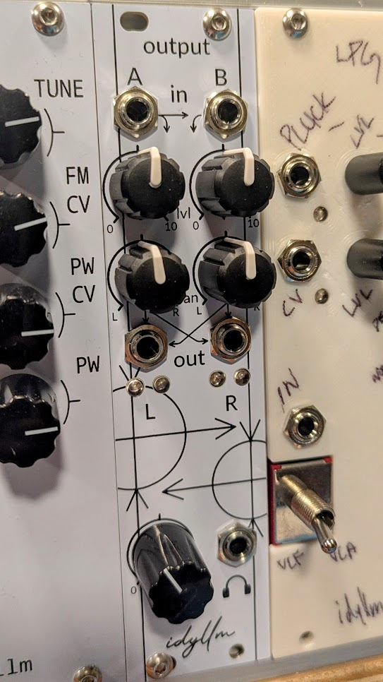

Assembly Guide
==============

Backplane
---------

Starting with the backplane board (with power input header), place and solder the flat-laying components

* D7, D8
* R37, R38 (may substitute ferrite bead or wire for both)
* R6, R22, R14
* D1, D4 (placed vertically)

Next, place and solder the socket for U1.

Place and solder the ceramic capacitors

* C2, C3, C5, C6
* C15, C16, C19, C20
* C21, C22

Next, place and solder the vertically-oriented 100k resistors

* R7, R12, R13, R15, R19, R20, R21

Place and solder the remaining vertically-oriented resistors near U1

* R10, R11
* R26, R27

Place and solder the remaining vertically-oriented resistors in the level meter stages (near Q1-Q4)

* R1, R5, R16, R24
* R2, R17
* R3, R18
* R4, R23
* R8, R25

Next, place and solder the BJTs

* Q1, Q3
* Q2, Q4

Place and solder the electrolytic capacitors

* C1, C4, C13, C14

Finally, place and solder the headers

* J8
* J5 (back side)

Optionally add the test point headers.

Frontplane
----------

Start by placing and soldering the sockets for U2 and U3.

Next, place and solder the ceramic capacitors,

* C7, C8
* C9, C10
* C17, C18, C23, C24

Place and solder the vertically-oriented resistors near U2 and U3

* R31, R32
* R33, R34
* R35, R36

Place and solder the pin header J7, oriented to the back of the board (attaches to J8).

Next, place and solder the remaining vertically-oriented resistors

* R4, R23
* R29, R30

Place and solder the audio jacks. Check the fit of the face plate before finalizing

* J1, J2, J3, J4
* J6 (may need to trim the standoff tabs to ensure all audio jacks are at the same height)

Place and solder the output coupling electrolytic capacitors. C11 sits on the top of the board and C12 is placed on the back side. Ensure that the leads are left sufficiently long so that C11 and C12 can be bent to a horizontal orientation and do not extend past the edge of the board.

Place and solder the potentiometers. Check the fit of the face plate before finalizing.

* RV1, RV2, RV3, RV4
* RV5

With the face plate temporarily installed, position and solder the red and green level LEDs. The LEDs should protrude slightly through the openings in the face plate.

* D2, D5
* D3, D6

Finishing 
---------

Install the ICs. On the backplane, insert U1. On the frontplane, insert U2 and U3.

Add the standoff on the backplane and connect the frontplane and backplane. Finish the build by attaching the face plate using the audio jack bushings.

